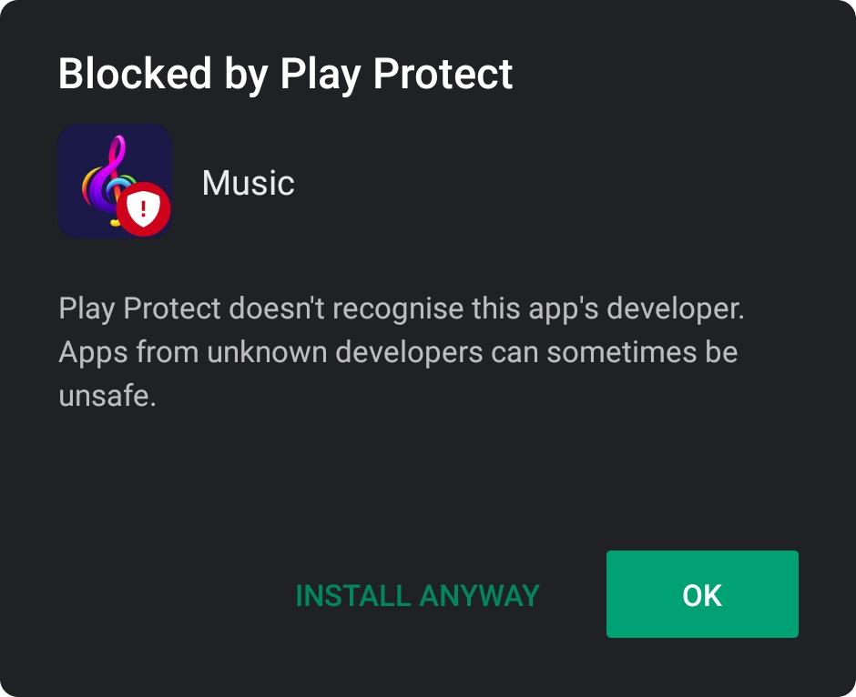

<div align="center">
  
</div>


# Music

Download and play songs from your phone. <br>
Optionally you can sync with firebase, allowing easy use of multiple devices.

Go [here](#downloading) for installation.

### Easily play and download songs

<div align="center">
   
</div>

<br>

### View all songs and by artists

<div align="center">
   
</div>

<br>

### Automatically generated albums as well as Custom ones

<div align="center">
   
</div>

<br>

### Shuffle and view queue

<div align="center">
  
</div>

> This app is the mobile version of [this app](https://github.com/Lutetium-Vanadium/music), which is out of date and is soon to be updated.

If you have any issues or suggestions, feel free to [open a pull request](https://github.com/Lutetium-Vanadium/music-flutter/pulls) or [file an issue](https://github.com/Lutetium-Vanadium/music-flutter/issues)

If you wish to customize or learn more about the project, go [here](docs/codestructure.md).

## Download and Installation

For android, you can directly download a built version of the latest release [here](https://github.com/Lutetium-Vanadium/Music-Flutter/releases). First generate the API Keys and then download the APK from the latest release.

If you are on iOS or want to download and build the project yourself, follow the steps given below.

### Api keys

The app requires [A Napster API Key](https://developer.napster.com/api/v2.2#getting-started), to function. You can also optionally add [Firebase](https://firebase.google.com/) for syncing.

Steps to create the API Keys can be viewed [here](docs/apikeys.md).

Once you have those created, you can move onto running the app.
You will need to enter the api keys directly in the app.

### Build Dependecies

First [install flutter](https://flutter.dev/docs/get-started/install). After that run:

```sh
flutter pub get
```

This will install dependecies.

### Testing

To run the tests, written for the app, run:

```sh
flutter test
```

### Running without a regular installation

If you wish to test the app to see if it works, connect a device or run an emulator. To start the `profile` mode app (runs faster than `debug` mode, but doesn't have the developer functionalities), run:

```sh
flutter run --profile
```

### Building

#### For android:

Signing the app:

- **Create a Keystore**

  If you have an existing keystore, skip to the next step. If not, create one by running the following at the command line:

  On Mac/Linux, use the following command:

  ```sh
  keytool -genkey -v -keystore ~/key.jks -keyalg RSA -keysize 2048 -validity 10000 -alias key
  ```

  On Windows, use the following command:

  ```batch
  keytool -genkey -v -keystore c:\Users\USER_NAME\key.jks -storetype JKS -keyalg RSA -keysize 2048 -validity 10000 -alias key
  ```

  This command stores the `key.jks` file in your home directory. If you want to store it elsewhere, change the argument you pass to the `-keystore` parameter.

  > - The keytool command might not be in your path—it’s part of Java, which is installed as part of Android Studio. For the concrete path, run flutter doctor -v and locate the path printed after ‘Java binary at:’. Then use that fully qualified path replacing java (at the end) with keytool. If your path includes space-separated names, such as Program Files, use platform-appropriate notation for the names. For example, on Mac/Linux use Program\ Files, and on Windows use "Program Files".
  > - The -storetype JKS tag is only required for Java 9 or newer. As of the Java 9 release, the keystore type defaults to PKS12.

- **Reference the keystore from the app**

  Create a file named `android/key.properties` that contains a reference to your keystore:

  ```properties
  storePassword=<password from previous step>
  keyPassword=<password from previous step>
  keyAlias=key
  storeFile=<location of the key store file, such as /home/<user name>/key.jks>
  ```

Building APK:

- 'fat' APK

  ```sh
  flutter build apk
  ```

  This will build a 'fat' APK, which contains code compiled for all architectures, which means it can run on all android devices.

- Split APKs

  ```sh
  flutter build apk --split-per-abi
  ```

  This will split it into different APKs, based on the architecture which results in smaller app sizes, but it only works on phones with the specific architecture.

Once finished building, the APK will be available at `build/app/outputs/apk/release/app-release.apk`. To install, either transfer the apk to your phone and install, or connect your device via USB Tethering and run:

```sh
flutter install
```

You may be shown this popup when installing the app:



You can safely click 'Install Anyway'.

#### For iOS

See flutter's [ios](https://flutter.dev/docs/deployment/ios) release documentaion.

## Issues

### IOS

The app was built with an android testing device and so it may not function fully as intended in ios. In general the UI will look and work the same, but platform specific things like notifications may not. For example, android allows for notifications to show while the app is open, but for ios does not.
