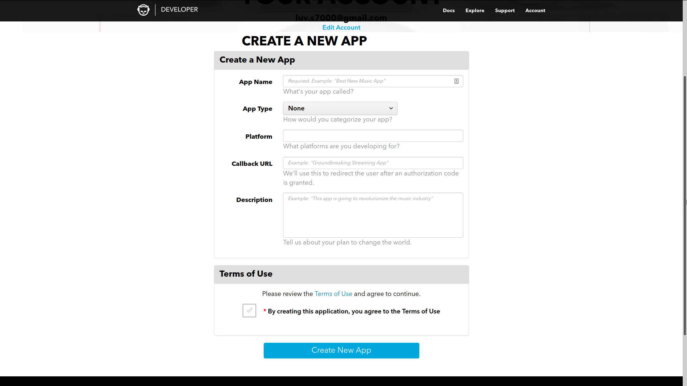

# Api Keys

## Napster

[The API provided by
Napster](https://developer.napster.com/api/v2.2#getting-started) is used
to get metadata about songs that you download. It is also used to
provide search results for when you are downloading songs.

> The Napster API allows upto 500 calls per second, after which it
> returns a `429: Too Many Requests`, but its extremely unlikely you
> will exceed that.

To get the API key, go to [napsters developer
website](https://developer.napster.com/developer), create an account and
click "Add New App". It will redirect to you a page like this:

You can add any dummy data you want, since auth is not used, the
callback url is never used and can be set to anything.

After creating the new app, it may take some time for them to approve
your app, once the status is approved, it should show the API Key which
is what is needed during set up of the app.
